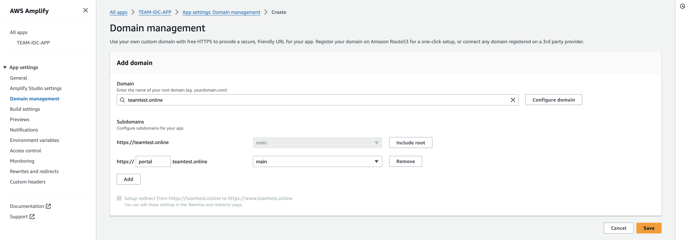

# Deployment Process
{: .no_toc}

<details open markdown="block">
  <summary>
    Table of contents
  </summary>
  {: .text-delta }
- TOC
{:toc}
</details>

---

## Clone TEAM repo
To clone the TEAM amplify fullstack project, execute the following command inside an empty directory

```sh
git clone https://github.com/aws-samples/iam-identity-center-team.git
```

This creates a directory named **iam-identity-center-team** in your current directory.

---

## Update deployment parameters

Create a new file named **parameters.sh** in the **deployment** directory. Copy the contents of the file **parameters-template.sh** to the new file. 

```sh
cd deployment
cp -n parameters-template.sh parameters.sh
```


Update the parameters in the **parameters.sh** file as follows:

**Parameters**

Required:
- **IDC_LOGIN_URL** - AWS IAM Identity Center Login URL
- **REGION** - AWS region where the application will be deployed.
    > This must be the same region AWS IAM Identity Center is deployed in
    {: .important}
- **TEAM_ACCOUNT** - ID of AWS Account into which TEAM application will be deployed
- **ORG_MASTER_PROFILE** - Named profile for Organisation master account
- **TEAM_ACCOUNT_PROFILE** - Named profile for TEAM Application deployment Account
- **TEAM_ADMIN_GROUP** - Name of IAM Identity Center group for TEAM administrators
- **TEAM_AUDITOR_GROUP** - Name of IAM Identity Center group for TEAM auditors

Optional:
- **TAGS** - Tags that should be propagated to nested stacks and underlying resources
- **CLOUDTRAIL_AUDIT_LOGS** - CloudTrail Event Data Store logging configuration. Options:
  - `read_write` - record read and write events
  - `read` - record only read events
  - `write` - record only write events
  - `none` - disable event logging
- **UI_DOMAIN** - Custom domain for Amplify hosted frontend application 

For example:

```sh
IDC_LOGIN_URL=https://d-12345678.awsapps.com/start
REGION=us-east-1
TEAM_ACCOUNT=123456789101
ORG_MASTER_PROFILE=OrgMAsterProfileName
TEAM_ACCOUNT_PROFILE=TeamAccountProfileName
TEAM_ADMIN_GROUP="team_admin_group_name"
TEAM_AUDITOR_GROUP="team_auditor_group_name"
TAGS="tag1=value1 tag2=value2"
CLOUDTRAIL_AUDIT_LOGS=read_write
UI_DOMAIN=portal.teamtest.online
```

---

## Run Initialisation Script
The **init.sh** bash script in the **deployment** folder configures the following prerequisites required for deploying the TEAM application:

- Configures the **TEAM_ACCOUNT** as a delegated admin for account management
- Configures the **TEAM_ACCOUNT** as a delegated admin for cloudtrail management
- Configures the **TEAM_ACCOUNT** as a delegated admin for AWS IAM Identity Center Management
  > Ensure that the named profile for the **Organisation Management account** has sufficient permissions before executing the **init.sh** script
  {: .note}

Execute the following command in the root directory to deploy the script

```sh
cd deployment
./init.sh
```

If the init.sh script is deployed successfully, the output should be similar as shown below

```
$ 123456789101 configured as delegated Admin for AWS Account Manager
$ 123456789101 configured as delegated Admin for cloudtrail
$ 123456789101 configured as delegated Admin for IAM Identity Center
```

---

## Run Deployment Script
The **deploy.sh** bash script in the **deployment** folder performs the following actions within the **TEAM_ACCOUNT** :

- Creates a CodeCommit repository and copies the TEAM application directory content to the repository.
- Deploys a cloudformation template that creates an amplify hosted application and CI/CD pipeline for deploying the TEAM application.

> Ensure that the named profile for the **TEAM Deployment account** has sufficient permissions before executing the **deploy.sh** script
{: .note}

Execute the following command in the root directory to deploy the script

```sh
cd deployment
./deploy.sh
```

Once the deployment script has completed execution and the cloudformation stack has been created successfully, go to the AWS Amplify console to monitor the status of the TEAM application deployment.

> It takes about 20 mins to complete the build and deployment of the Amplify application stack
{: .note}

## Custom Domain Registration
> This step is optional and required only if you have included a **UI_DOMAIN** parameter and intend to use a custom domain for your TEAM deployment instead of the default amplify generated domain name. 

Go to Amplify console: AWS AMPLIFY → All Apps → TEAM-IDC-APP → Domain Management → Add domain.



Follow instructions in Amplify documentation for more details on [setting up custom domains](https://docs.aws.amazon.com/amplify/latest/userguide/custom-domains.html)


## Verify app deployment
Go to Amplify console: **AWS Amplify -> All apps -> TEAM-IDC-APP -> Hosting environments**. On the **Hosting environments** tab, click on the application URL to confirm that it was deployed successfully and you can access the TEAM application landing page as shown in the video below:

<video width="750" height="420" frameborder="0" allowfullscreen controls>
<source src="https://d3f99z5n3ls8r1.cloudfront.net/videos/deployment/successful_app_deployment.mov" type="video/mp4">
</video>


### 🚀 Next Step: [Configure TEAM Application]()
{: .no_toc}

## Deploying TEAM into management account
> We strongly recommend and encourage deploying TEAM into a **delegated admin account** (**not management account**) as per [AWS best practice](https://docs.aws.amazon.com/organizations/latest/userguide/orgs_best-practices_mgmt-acct.html#best-practices_mgmt-use). If you have a valid use case for deploying in the management account, please proceed with caution and consider the necessity of stringent management account access controls.
{: .warning}

To deploy TEAM into management account:

1. Instead of using **parameters-template.sh** file, use the provided **parameters-mgmt-template.sh** as a template for your **paramaters.sh** file. This file omits the following parameters:
   - **TEAM_ACCOUNT**
   - **TEAM_ACCOUNT_PROFILE**

    and uses **ORG_MASTER_PROFILE** to deploy the solution.

2. Do **not** run the initialisation script **init.sh**. You can proceed straight to running the deployment script **deploy.sh**.

